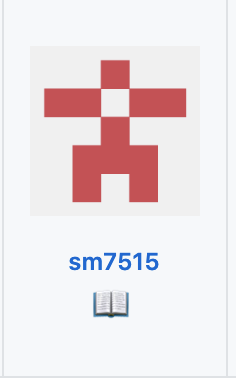

This week, I was browsing through the issue page in p5.js's repo and I found one that is not assigned to others. It is about making the documentation more clear.

So, p5.js has a function called `LoadImage()`, where you pass in the path to the image file and the function will load the image on the screen. What's not specified in the documentation is that you can also pass in a base64 string representation of the image to the function as an alternative to the file path.

After I edited the doc and made a pull request, I realized that I failed at the test. It took me a while to figure out why I would fail. It turned out that I didn't pass the linting test. They have a strict set of rules for formatting and my VSCode extension "Prettier," automatically formats my code in a completely different way, like changing all single quotes to double quotes and adding unnecessary spaces. Finally, I gave up on this fancy extension and ended up editing the code using Sublime.

After my pull request is merged, there is a [allcontributors] bot that automatically issue a closed pull request about adding me to the recent contributors.

And here I am, at the contributor section on their Readme page!

