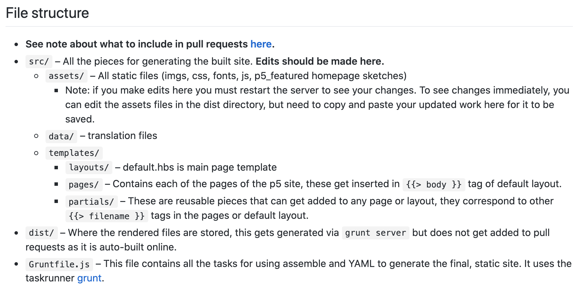

It's a wrap...

### Final Thoughts
  
  I think I have talked about this for a million times, but I have to say it one last time in this final blog post that we are really lucky to come across p5.js and decide to work on it for this whole semester. This friendly, active and welcoming community and the overall positive experience with them definitely make my life a lot easier as a first-timer open source contributor. Especially compared to other groups where they need to set up a specific environment, we don't need to install or use any extra environment or tools. 
  
  At first, I was intimidated by the project because even though I have experience with web development before, I have never worked with yml or grunt before and worked on a project that at this scale. But luckily, they have a section dedicated to explain their file structure.
  
  
  I also had a great team. We collaborated really well despite the time differences. We don't call once every week, but we are very active and responsive on slack; and we would schedule a call if we think we need to discuss something seriously like for practicing final presentation.
  
  In the beginning, we had kind of a rough time selecting the right project we want to contribute to. We called multiple times vai zoom to look at some projects and evaluate those together. I think four of us are all very engaging during the process and honest with our opinions, which makes our teamwork very efficient.
  
  Since the last standup, we decided that we would find a way to collaborate under one issue together because we didn't have the chance to do so and we have been working on our own separate issues. One of our teammates found an entire section of examples that is missing on their website and we got the permission to work on it. So far, we have one merged in, one pull request open and one we still are working on.
  
### Takeaway
  
  Even if some of my contributions are bug fixes, they are not as simple as it seems. This experience allows me to work with a much larger project and deal with relatively unfamiliar code base. I learned a lot about reading the code base, figuring out on my own how each parts of the website function and how are they linked together. After this, I felt like I am a more "mature" computer science student ---- collaborating with other people, using git, raising issue and making pull requests, understanding other people's code and finding ways to solve all kinds of problems...
  
### Presentation

  I also enjoyed the presentation of group Inky. I think the fact that they actually use it makes the issue they raise really useful and interesting, like making Inky the default application or adding font styles.
